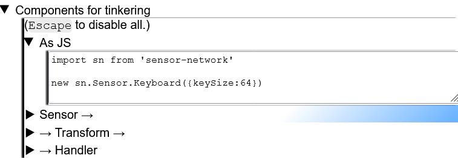

## Sensor network

Tools for connecting humans and AI models to arbitrary sensors: differentiable [subscribe/publish](https://en.wikipedia.org/wiki/Publish%E2%80%93subscribe_pattern).

It can represent streams of [any](https://github.com/Antipurity/sensor-network/tree/master/docs/universal-environments.md) named observations and actions.

## Design constraints

- Position-invariance, of cells into which data is divided. This enables hotswappable and user-defined observations/actions, which is how humans [expect ](https://en.wikipedia.org/wiki/Process_(computing))[computers ](https://en.wikipedia.org/wiki/USB)[to operate ](https://en.wikipedia.org/wiki/Internet_of_things)[anyway.](https://en.wikipedia.org/wiki/Internet) In ML, [Transformers are currently dominant anyway.](https://arxiv.org/abs/1706.03762)
- -1…1 values, optionally, [mostly for humans.](https://www.reddit.com/r/NoStupidQuestions/comments/65o0gi/how_loud_is_a_nuclear_explosion_all_noise_is/)
- That's all. A human can use it. AGI can use it.

## You can:

- Collect the [re](https://arxiv.org/abs/2102.06701)[q](https://arxiv.org/abs/1712.00409)[ui](https://arxiv.org/abs/2001.08361)[re](https://arxiv.org/abs/2006.10621)[d](https://arxiv.org/abs/2010.14701) data for machine learning. [From a web page.](https://github.com/Antipurity/sensor-network/tree/master/js-lib)
- [Mix-and-match multimodal tasks of variable size](https://arxiv.org/abs/2106.09017)[,](https://arxiv.org/pdf/2106.02584.pdf)[ with 0 or more objectives](https://arxiv.org/abs/2112.15422).
- [Not worry about efficiency.](https://github.com/Antipurity/sensor-network/tree/master/js-lib/test)
- [Fully ](https://github.com/Antipurity/sensor-network/tree/master/docs/privacy.md)[control](https://Antipurity.github.io/sensor-network) your computer interaction data: [collect it](https://github.com/Antipurity/sensor-network/tree/master/js-lib/docs/README.md#sn-sensor), [store it](https://github.com/Antipurity/sensor-network/tree/master/js-lib/docs/README.md#sn-handler-storage), [extend it over the Internet](https://github.com/Antipurity/sensor-network/tree/master/js-lib/docs/README.md#sn-handler-internet).
- [Listen to data as unpleasant raw sounds.](https://github.com/Antipurity/sensor-network/tree/master/js-lib/docs/README.md#sn-handler-sound)

## You should [eventually](https://github.com/Antipurity/sensor-network/tree/master/docs/ROADMAP.md) be able to:

- Trust in this implementation's production-ready robustness and efficiency.
- Integrate with any OS-level and device-level data.
- Integrate with any machine learning framework and dataset, and allow distilling any ML model. Reachable performance should not deteriorate very significantly compared to non-named representations, either time or objective.
- Equalize capabilities of humans and machines:
    - Enhance machines, by making data about human activity available, and re-using models as much as possible, thus driving the friction and fundamental differences to zero. [Thought ](https://books.google.com.ua/books?id=wT04AAAAIAAJ&redir_esc=y)[is ](https://en.wikipedia.org/wiki/How_to_Create_a_Mind)[largely ](https://en.wikipedia.org/wiki/Hierarchical_temporal_memory)[modeling](https://ai.facebook.com/blog/self-supervised-learning-the-dark-matter-of-intelligence/), [and ](http://proceedings.mlr.press/v139/hashimoto21a/hashimoto21a.pdf)[modeling needs data](https://static.googleusercontent.com/media/research.google.com/en//pubs/archive/35179.pdf)[ to model human thought,](https://en.wikipedia.org/wiki/Mind_uploading)[ so that data might eventually become obsolete.](https://arxiv.org/abs/2106.09017)
    - Enhance [humans](https://repository.upenn.edu/cgi/viewcontent.cgi?article=1107&context=mgmt_papers), [merging](https://towardsdatascience.com/merging-with-ai-how-to-make-a-brain-computer-interface-to-communicate-with-google-using-keras-and-f9414c540a92)[with](https://venturebeat.com/2020/11/23/this-is-how-well-merge-with-ai/)[AI](https://en.wikipedia.org/wiki/Lovecraftian_horror): adding and removing senses at will, [being predicted for 'soft mind uploading'](https://cmte.ieee.org/futuredirections/2018/06/04/mind-uploading-vs-mind-virtualisation-ii-2/), [being analyzed in full](https://github.com/likedan/Awesome-CoreML-Models), [and](https://en.wikipedia.org/wiki/Simulated_reality)effectively replacing the one real world with [a rainbow of possibility](https://en.wikipedia.org/wiki/Noosphere).
        - More concretely, transform real-time data into a [rele](https://deepsense.ai/what-is-reinforcement-learning-the-complete-guide/)[vant](https://arxiv.org/abs/2009.01325) [comp](https://en.wikipedia.org/wiki/Self-supervised_learning)[r](https://www.tensorflow.org/tutorials/generative/autoencoder)[e](https://arxiv.org/abs/2006.07733)[s](https://arxiv.org/abs/2109.01819)[s](https://arxiv.org/abs/1708.07860)[ed](https://arxiv.org/abs/1811.10959) summary, and [translate](https://github.com/Antipurity/sensor-network/tree/master/docs/human-sense-constraints.md) limited [human ](https://deepmind.com/research/publications/2021/Creating-Interactive-Agents-with-Imitation-Learning)[actions](https://intelligence.org/files/QuantilizersSaferAlternative.pdf) into any [machine-accessible](https://github.com/Antipurity/sensor-network/tree/master/docs/universal-environments.md) actions. And [propagate](https://www.weforum.org/agenda/2018/01/the-secret-of-groundbreaking-science-global-collaboration/) the precedent of some human-AI symbiosis.
- Take control of an enemy spaceship in seconds like it's sci-fi. Once spaceships are invented.
- Essentially no design constraints, so, possibly [eventua](https://en.wikipedia.org/wiki/The_Singularity_Is_Near)[lly ](https://www.academia.edu/36810724/The_21st_Century_Singularity_and_its_Big_History_Implications_A_re_analysis)[AGI?](http://www.incompleteideas.net/IncIdeas/BitterLesson.html)